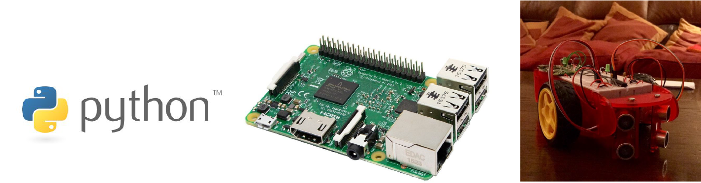

# Session 0 Workbook - Physical Computing

# Welcome!

Welcome to the Physical Computing theme of the 2nd Year Hackspace Horizons Course. There will be 3 sessions for this theme which will be as follows:

Session 0: Basic Raspberry Pi Introduction and SSH

Session 1: Basic Python, building the robot and sensors

Session 2: More sensors

Session 3: The Challenge...

    
    <figcaption align="center">Python</figcaption>

