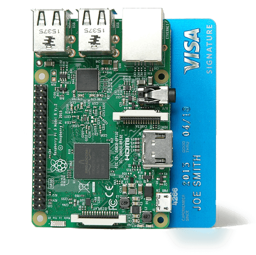
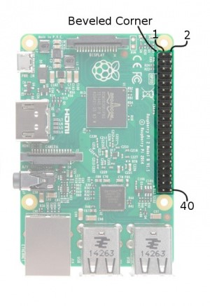

# Session 1 Workbook - Physical Computing

<p align="center">
    
</p>

## Course Structure

Welcome to the Physical Computing theme of the 2nd Year Hackspace Horizons Course. There will be 3 sessions for this theme which will be as follows:

Session 1: Basic Raspberry Pi Introduction, SSH and Basic Python

Session 2: Motors and sensors

Session 3: The Challenge...

## Assessment

This theme will have homework after each session to ensure you keep on track with all the work. The homework will be submitted online and will be marked as pass/fail. 

At the end of the theme you will also submit a Success/Failures document which has a word limit of 400 words (+/-10%). The emphasis of this document will be on understanding your problems, how you went about solving them and why your solutions may not have worked. Note the emphasis is not on everything working, but on how well you understood what was wrong or what didn't work and why it didn't work. The structure can follow something similar to:

1. Introduction
2. What was your task and how did you try to achieve it?
3. What worked?
4. What failed? And why did it fail?


# How to use this workbook

Welcome back to the Physical Computing Theme!

This session will be a workshop with lots of practical exercises that you can work through at your own pace. This is to ensure that you all gain something from this course, independent of your current Python and general programming knowledge.

We will work through this sheet as follows. For each of the following chapters, the tasks are grouped into **ascending order of difficulty**. Please attempt all tasks under **Mandatory exercises**, and if you have time before we move on, have fun with the **Optional exercises**.

**One plea**: If you are done earlier than your neighbour, please help us out by offering your help to them. Explaining something is a sure-fire way to really understand it yourself!

# Homework for the next Session

Any unfinished Mandatory Exercises from the Recap chapter will be your homework.

 **This is mandatory.** For assessing your homework, we expect a coded solution. However, if you really get stuck with an exercise, this is not a problem, and instead of program code, we need you to explain as well as you can where and how you got stuck. It is just as useful being able to describe what the problem is as it is to solve it.

# Writing Python programs on Raspberry Pi

## The Raspberry Pi computer

Raspberry Pi is a small computer the size of a credit card that you can plug into a monitor, keyboard and mouse. You can use it in the same way as you would use your desktop PC or laptop. You can generate spreadsheets, do word processing, browse the internet, and play games. It also plays high-definition video.

However, what will make it interesting for us is its capability for use in electronics projects! The main aim of the Raspberry Pi is to teach anyone how to use programming and electronics to realise their ideas. Raspberry Pi comes with a free Linux operating system that runs from an SD card, and it is powered by a USB phone charger.

<p align="center">
    
    <figcaption align="center">The Raspberry Pi (version 3)</figcaption>
</p>

## Models of Raspberry Pi

Since its original launch in 2012 there have been a number of different models with the most recent model having a quad core processor runnning at 1.4GHz and with 1GB of RAM.

<p align="center">
    
</p>
<p align="center">
    
    <figcaption align="center">Different Raspberry Pi models through the years</figcaption>
</p>

We will be working with the RPi 3 Model B which is based around a 1.2 GHz 64-bit quad-core ARM Cortex-A53 processor, has 1GB of RAM, while the smaller and cheaper Zero W is based on a 1 GHz single-core ARM1176JZF-S processor with 512GB RAM. Both have 802.11n Wireless and Bluetooth 4.1 included on the chip. Look at them – all of this is included in those black chips soldered onto the boards! That's also why we call these little wonders "System on a Chip" – the entire computer system resides in silicon.

## Physical layout of Raspberry Pi

<p align="center">
    
    <figcaption align="center">Raspberry Pi Layout</figcaption>
</p>

The above picture shows a Raspberry Pi 3. On the right-hand side, you have four **USB ports** and one **Ethernet** port. Next to the USB ports, there is a **USB/Ethernet Controller**, which translates data between the ports and the main processor, because the processor itself doesn't understand the USB or Ethernet protocol. At the top, you can find the **General Purpose Input/Output (GPIO) pins** (40 of them to be precise). Down the bottom middle is the **CSI (Camera Serial Interface) connector**, which allows you to connect mobile-phone-style cameras directly to the Pi. Of course, you also have the option to connect a webcam via USB. At the right-hand side, you can find a **DSI (Display Serial Interface) connector** that you can use to connect an LCD screen. At the bottom, you can find the **HDMI port**, which allows you to connect the Pi straight into a monitor. Next to this port, you can see the **USB power connector** and also an **audio port**. The back side of the Pi houses a micro SD card slot for the SD card containing the operating system and user data – just like a classical hard disk.

## Important Note

Before we continue, please be aware of the following limitations when using your Raspberry Pi.

* Always make sure you supply only 5V to the RPi.
* Unlike Arduino, RPi does not have over-voltage protection on the board (yet), so be careful when making GPIO connections.
* Never connect more than a potential difference of 3.3V to the GPIO pins (for example, when using sensors to feed data into the Pi).
* Never demand that any GPIO pin source or sink more than 16mA.
* Pins can only supply a maximum current of 50mA.

During this workshop, if you are unsure about connecting something new to your Raspberry Pi (particularly anything feeding a voltage or a current into it), do come and ask one of us mentors first – it might prevent your board from frying! Let us now consider what we _can_ do with those pins!

## General Purpose I/O Pins (GPIO)

Your Raspberry Pi is more than just a small computer; it is a hardware prototyping tool! The RPi has **bi-directional I/O pins**, which you can use to drive LEDs, spin motors, or read button presses. Using these pins requires a bit or programming. While you can use a [variety of programming languages](http://elinux.org/RPi_Low-level_peripherals#GPIO_Code_examples) to \"do\" GPIO, we will use a reliable, easy-to-use language throughout this hackathon: **Python**.

###  GPIO Pinout

As we saw above, the GPIO is arranged as a header of 40 electrical pins, which makes it easy to connect it with an external circuit, using jumper wires.

<p align="center">
    
    <figcaption align="center">Raspberry Pi GPIO Orientation</figcaption>
</p>

<p align="center">
    
    <figcaption align="center">Raspberry Pi GPIO Layout</figcaption>
</p>

The image also shows the additional data protocols that can be accessed through some of the GPIO pins: [Serial (UART)](https://learn.sparkfun.com/tutorials/serial-communication), [I2C](https://learn.sparkfun.com/tutorials/i2c), [SPI](https://learn.sparkfun.com/tutorials/serial-peripheral-interface-spi), Pulse width modulation ([PWM](https://learn.sparkfun.com/tutorials/pulse-width-modulation). We will actually use the I2C protocol to control an external circuit board for DC motors later.

## The tools of the trade - the Linux terminal, a code editor and SSH

But how about (a) writing, and (b) executing Python programs on the Rasberry Pi?

For writing programs, we suggest using **Geany**, which is one of the pre-installed code editors on your Raspberry Pi. It has the handy feature that it highlights (i.e., colour-annotates) our programs as we write them, which helps a lot with their readability.

You find Geany in the Programming menu, as shown in the following picture.

<p align="center">
    
    <figcaption align="center">Opening the Geany script editor</figcaption>
</p>

The user interface is rather self-explanatory, with commands like CTRL+S (save), CTRL+O (open a file) etc. working as expected. It looks like shown below. Note that the program text has been coloured automatically.

<p align="center">
    
    <figcaption align="center">The Geany user interface</figcaption>
</p>

Alternatively you can create the programs on your own laptop and copy them over to the raspberry pi over SSH (Secure Socket Shell). For our sessions we will use repl.it which is an online IDE that can interpret and compile your code. Using this we do not have to worry about what operating system we are on and installing any new software. Simply write the code online, download it and copy it across as shown below.

But how to actually run the program, so the computer can do what we ask it to do? That's where the Linux terminal comes in handy. Look again at the main menu bar in the Figure above. The terminal is the black symbol with <kbd>**>\_**</kbd> in it, at the top of the screen. Once you've clicked on it, the below window appears.

<p align="center">
    
    <figcaption align="center">The Linux terminal</figcaption>
</p>

We will show you how you can run a program from within the Terminal. The most important Terminal commands are listed in the table below.

| Command       | Effect     | 
| ------------- |:-------------| 
| ```ls``` | List the contents of the current folder |
| ```cd``` _folder_ | **C**hange **d**irectory into _folder_ |
| ```cd ..``` | Change into the parent folder of the current folder |
| ```cd``` | ```cd``` without argument changes back to the user's home folder (/home/pi) |
| ```pwd``` | **P**resent **w**orking **d**irectory. This prints out the location of the current folder. |
| ```python3``` _program.py_ | Run the program called _program.py_ in Python 3 |

Hint: You can use tab completion. For example, when typing ```cd```+<kbd>Tab</kbd>, the Terminal automatically lists all possible folders that are available for changing into.

Long story short - the Terminal is much like a text-based file explorer, bolted together with a powerful general "command centre" for your computer. You can also start the usual programs from within the terminal. Just type ```chromium```+<kbd>Enter</kbd>.

## SSH: Secure Socket Shell

Raspberry Pis are great for electronics projects - they're quick and easy to use and can be set up to work headless i.e. they can work without a screen. Although this is a little more difficult to work with it makes it great when we want to update code on the Raspberry Pi while it is buried in the middle of our projects. To access our pi without a screen we can use SSH, which forms a secure connection between your device and the pi and provides you access to the command line on the Raspberry Pi.

Normally you can connect to a pi over SSH that is on the same network, for example at home if your pi is connected to your wifi and so is your laptop, you can connect to it over SSH by simply typing ssh pi@PI_IP_ADDRESS in a terminal (Linux/Mac) or using a program like PuTTy (windows).

In our case there are some further difficulties. If we connect the Raspbery Pi to the Imperial-WPA wifi network we have no way of checking the IP address of the pi without connecting a screen. Therefore we are going to use a direct point to point connection to the Raspberry Pi with an ethernet cable. Lucky for you all, the Raspberry Pi has already been setup to do this, however we will need to setup a static IP for your laptops and setup the gateway.

To do this simply follow the instructions below depending on your operating system. For our configuration settings please see below. **Note: If you have your laptops setup with specific proxy settings etc then please make a note of them! Most computers are setup to obtain IP address automatically and for these laptops it is not an issue to change this setting and quickly and change it back.**

[Windows](https://www.howtogeek.com/howto/19249/how-to-assign-a-static-ip-address-in-xp-vista-or-windows-7/)
[Macbook](http://www.macinstruct.com/node/550)

The configuration settings are:

```
IP Address: 192.168.4.1
Subnet Mask: 255.255.255.0
Default Gateway: 192.168.4.1
```

Connect the ethernet cable to the raspberry pi and to your laptop (please ask for an adapter if needed). Now connect up the 5V power adapter to the pi and turn it on. A red light should come on and a flashing green light. After roughly 20 seconds the Raspberry pi will have completed booting. Now on your computers try the following instructions:

### Linux/Mac:

Open a terminal and type in ```SSH pi@192.168.4.2```. If it asks you if you want to continue connecting then please type ```yes```+<kbd>Enter</kbd>. If it asks you for a password then try the default rapsberry pi password ```raspberry```.

### Windows:

Download PuTTy, an SSH and telnet client [here](https://www.chiark.greenend.org.uk/~sgtatham/putty/latest.html). After you have downloaded and installed PuTTy, try running it and you should be met with a screen as below:

<p align="center">
    
    <figcaption align="center">PuTTy: an SSH and telnet client</figcaption>
</p>

On the left hand bar select Session and fill in the details as follows: 

```
Hostname (or ip address):192.168.4.2
Port:22
Connection Type:SSH
```

You can even save this configuration so you can pull it up next time instead of typing it all out again. Now click ```Open``` and you should be met with a black terminal screen and you may get a popup asking if you are sure to connect. Click Yes. On the black terminal screen you will get a prompt for the login details:

```
login as: pi
password: raspberry
```

If all goes well you should be met with the screen below:

<p align="center">
    
    <figcaption align="center">Successfully SSH raspberry pi</figcaption>
</p>

Now that we have successfully used SSH lets do some work on the Pi! First of all lets create a directory for all your files. In the terminal that is SSh in to the Pi type:

```
cd /home/pi/
mkdir horizons
cd horizons
```

# A quick Blink example!

At this point in time it would be good to run a quick test with some basic Python and an LED. In the proggramming world the first example code you will always do in any tutorial is to write ```Hello World!``` to the screen. In the hardware world the first example you will usually do will be to blink an LED! So lets give it a go...

## Blink an LED

You should have all downloaded a text editor or have a preferred IDE that you can work in. My personal choice is Sublime Text. Open a new file in Sublime Text and write the following code:

```python
import gpiozero
import time

red = gpiozero.LED(17)

red.on()
time.sleep(2)
red.off()
time.sleep(2)
red.on()
time.sleep(2)
red.off()
time.sleep(2)
```

Now please note, this is not good code! But for now this is a good example - when you run this code you should see the LED turn on for 2 seconds, off for two seconds, on for two seconds and then off again.

So we wrote the code, but how do we use it on the Pi?

## Working with files on the Pi

As you know we do not have a screen connected to the Raspberry Pi right now, which may confuse some of you for the next bit. Lets say we wanted to write some code and run it on the Pi. How would we do this? There are two ways we can use here, either we write the file on our own laptops in a text editor and copy it over, or we write it directly on the pi in the terminal. 

### Copying a file over to the Raspberry Pi

As some of you may find it is nicer to work within a known code editor that you are comfortable with. Once you have made this file on your laptop you can then copy this over to the Raspberry Pi and run it. So lets try this, create a simple text file called blinky.py on the Desktop on your laptop.

Now lets copy your file over to the Raspberry Pi. We can do this using SCP (Secure File Copy). Don't forget to connet to your RPi network again before trying the next steps.

If you are using Mac/Linux then you do not require any extra software. Simply open a terminal and change directory to the Desktop and type:

```scp blinky.py pi@192.168.4.2:/home/pi/horizons```

If you are using Windows then you will need the program PuTTy which we mentioned in the previous lesson. You can download it [here](https://www.chiark.greenend.org.uk/~sgtatham/putty/latest.html). Download the MSI('Windows Installer') and install it.

Once you have installed PuTTy you can open the command prompt in Windows and change directory to the Desktop. Now use the pscp command to transfer the file.

```pscp -scp blinky.py pi@192.168.4.2:/home/pi/horizons```

Now if you ssh into your Raspberry Pi and list the files in the Desktop folder you will see your text file has been copied across!

### Using a file editor on the Raspberry Pi

If you wanted you could also create and edit a file directly on the RPi. Lets try this. First SSH into the RPi:

```ssh pi@192.168.4.2```

Then change directory to the horizons folder. 

```
cd /home/pi/horizons
```

Now we are going to use one of the built in file editors for Linux systems called Nano. It is a very nice and easy terminal text editor. So to run it type:

```nano blinky.py```

This will open a text editor in your terminal as shown below:

<p align="center">
    
    <figcaption align="center">Nano in the terminal</figcaption>
</p>

Note that within this text editor you cannot just click where you want to go but have to move there using the keypad on your keyboard. Then you can type whatever you need so lets try typing ```Hello World!``` at the top of the file and to exit you click <kbd>CTRL</kbd>+<kbd>X</kbd> on your keyboard. Click <kbd>y</kbd> and <kbd>Enter</kbd> to save it under the same file name.

Now we know what a Raspberry Pi is and how to copy files to it.

## Using a breadboard

An electronics breadboard are great units for prototyping or making quick temporary circuits and they generally require no soldering. If you are not sure how a certain circuit will react, its best to prototype it out and usually this is done using a breadboard.

Some of you who have previously worked with electronics may have already seen a breadboard. They come in different sizes and configurations but generally are very similar. A breadboard will always have a DIP ravine in the centre of the breadboard. This is so that you can place IC chips in the middle with pins on either side. Also your breadboard may have a set of rails running along the top and bottom. Lets have a look at a small breadboard:

<p align="center">
    
    <figcaption align="center">Medium sized breadboard with exposed pins</figcaption>
</p>

So on the left is the top side of the board where you would place your components and on the right is the bottom side of the board. Usually a breadboard has some backing on it so you cannot see the exposed metal components but we have peeled it off here so you can see the inner workings of the breadboard. Now the metal lines you can see are actually rows of pins as shown in the image below and each of these metal rows have clips at the top that are just under the plastic surface of the breadboard. When you plug in a wire or a leg of a component it is held in place by these metal clips.

<p align="center">
    
    <figcaption align="center">Metal pins inside the breadboard</figcaption>
</p>

As you can see you have vertical rows and horizontal rows of these metal clips. The vertical rows are used for common rails such as 5V and GND. Note that the vertical rows running on both sides are not connected, traditionally on simple circuits you would run a wire from each side bridging these to allow for rails on either side of the breadboard making it easier when building your circuits. The horizontal rows are for placing your components and allowing for multiple connections off one pin. Note the horizontal rows are not connected in the middle. This is so that you can place IC chips in the middle allowing for half the pins to be on either side and not be bridged across.

<p align="center">
    
</p>
<p align="center">
    
<p align="center">
  <figcaption align="center">Top: Bridging rails on either side of breadboard. Bottom: DIP ravine to place IC</figcaption>
</p>

### Blinking an LED

Connect an LED via a resistor to the Ground (GND) and GPIO pin 17 (GP17). Note that the shorter wire of the LED needs to connect to ground.

<p align="center">
    
    <figcaption align="center">Connecting an LED to the Pi</figcaption>
</p>

# Homework

In this lesson we have looked at what is the Raspberry Pi, how to connect to it and writing Python code and then running it on the Raspberry Pi. For homework you should go through the remaining sections below learning about Python and trying out the examples as shown. Some of you may already have Python installed on your laptops so feel free to use this if you wish. Please make sure you use Python 3 and not Python 2.7. If you do not then you can use an online compiler at [repl.it](www.repl.it). Select Python from the dropdown box.

In Repl.it there are three main sections to the screen, on the left you have the file explorer, in the middle you have your text editor, and on the right you have the interactive python terminal where you can also write python code. For your homework go through the sections below trying out all the examples as well. Get an understanding of how Python works and try experimenting. Finally complete the mandatory exercises as best as you can. If you struggle then feel free to ask a staff member and give an understanding of what you are trying to do and why.

# Basic Python: Variables, Operators, Data Types

Programming languages hold data in variables. Just like in maths, variables in Python are a convenient way to refer to a quantity through a memorable name.

```Python
number_of_hands = 2 # Hold the value 2 in a variable called "number_of_hands"
fingers_per_hand = 5 # Hold the value 3 in a variable called "fingers_per_hand"
number_of_fingers = number_of_hands * fingers_per_hand # What value will this be?
```

Variable names must start with a letter and should only contain letters, numbers and underscores.

In this example, we used hashtags to mark everything behind them as **comments**, which are not executed.

Programming languages use different **data types** for different types of data. It's horses for courses with this, and unsurprisingly Python supports text, integers, floating point and Boolean data, to name a few.

For example:

```python
x  = 1
some_text = "Hello World!"
some_boolean = False
```

We can perform mathematical calculations in Python using the basic operators `+`, `-`, `*`, `/`, `**`, `%`.

```python
4 + 5
4 - 3
2 * 3
3 / 4
2 ** 3 # Returns 2 to the power of 3
10 % 7 # Returns the remainder of a division
```

In Python, the [standard order of operations](https://en.wikibooks.org/wiki/Python_Programming/Basic_Math) is from left to right, and respects the mathematical precedence of operations (memorised by many as PEMDAS):

| Name        | Syntax     | Description  |
| ------------- |:-------------:| :-----|
| **P**arentheses     | ( ... ) | Happening before operating on anything else.|
| **E**xponents     | **  |  Exponents are evaluated before multiplication and division. |
| **M**ultiplication and **D**ivision | * / | |
| **A**ddition and **S**ubtraction | + -  | |

Let's try it:

```python
3 / 4 * 5  # First division and then multiplication
6 + 7 * 9
2 ** 8
10 % 7 # Remainder of a division
```

The following table lists Python's comparison operators. Operations involving these return the Boolean values `True` or `False`, depending on whether the statement is true or not.

| Name        | Syntax     |
| :-------------: |:-------------|
| < | Less than|
| > | Greater than|
| <=| Less than or equal to|
|>=	| Greater than or equal to|
|==	| Equal to|
|!=	| Not equal to|

You can combine logic statements using the keywords `and`, `or` and `not`. What will the following statements return?

```python
2 == 3
3 == 3
2 < 3
True == (False != True)
"Asterix" == "Obelix" or not("Idefix" == "Idefix")
```

There are more operators, which you can read about [here](https://www.tutorialspoint.com/python/python_basic_operators.htm).

## Strings, Lists and Indexing

The data stored in memory can be of different types; Python has five basic ones: **Numbers** and **Strings**, which we have encountered above, and also **List**, which we will touch upon below. (We won't have time to cover the [**Tuple**](https://www.tutorialspoint.com/python/python_tuples.htm) and [**Dictionary**](https://www.tutorialspoint.com/python/python_dictionary.htm) types.)

Re-using the above:

```python
type(number_of_hands) # Number
type(fingers_per_hand)
type(some_text) # String
```

**Strings** in Python are a set of characters grouped together in quotation marks. Python allows either a pair of single or double quotes.

**Lists** are the most versatile data types in Python. A list contains items separated by commas and enclosed in square brackets `[ ... ]`. In Python, all the items belonging to a list can be of different data type.

The values stored in a list can be accessed using the slice operator (`[]` and `[:]`) with indexes **starting at 0 at the beginning of the list**. That's a popular stumbling block, so beware!

The plus sign is the list concatenation operator, and the asterisk (`*`) is the repetition operator.

```python
examplelist = [ 'abc', 12 , 2.23, 'john', 70.2 ]
tinylist = [123, 'john']

my_name = "John Doe"
my_job = "technician"

print(examplelist)            # Prints complete list
print(examplelist[0])         # Prints first element of the list
print(examplelist[1:3])       # Prints elements starting from 2nd till 3rd
print(examplelist[2:])        # Prints elements starting from 3rd element
print(examplelist[-1])        # Negative indexing: Prints the last element of the list
print(tinylist * 2)    # Prints list two times
print(examplelist + tinylist) # Prints concatenated lists

print(my_name[0])      # Strings behave very similarly to lists
print(my_name + my_job)# String concatenation
```

Finally, you can use the `len(...)` function to find the length of a list or string.

## Control flow

We have so far seen many small bits of software that fulfil one specific task at a time (like assigning a value to a variable, or accepting user input). In order to tackle more complex tasks, we need to combine many of these items into one larger computer program. Think of programs as cooking recipes: They are a sequence of statements (i.e., lines of code), to be executed by a very quick and accurate, but also adhere-to-the-letter type of cook (your Raspberry Pi).

As programmers, we set up “paths” for the program to follow. Can you tell the output of the program?

<p align="center">

</p>

## Conditional statements

Conditional statements allow the program to react to new information _whilst it is running_ ("at runtime").

We use the `if (...):`-`elif (...):`-`else:` construct for this scenario. For example &ndash;

```python
weight = input("Please input your weight in kg: ")
height = input("Please input your height in m: ")
# Need to convert strings to actual number types, using the float(...) function
bmi = float(weight) / float(height) ** 2
if (bmi >=16 and bmi < 18.5):
    print("Your BMI looks a bit low (underweight).")
elif (bmi >= 18.5 and bmi < 25):
    print("Your BMI is considered healthy.")
elif (bmi >= 25 and bmi < 30):
    print("Your BMI looks a bit large (overweight).")
else:
    print("According to your BMI, you are severely over- or underweight.")
```

Two important points to remember:
1. **Code blocks that are executed inside an `if`/`elif`/`else` statement are indented with a tab. This is Python's way to group code into blocks.**
2. **These code blocks start after a colon and end when the indentation stops.**

## Repeating code: Loops

Often, we need an action to be repeated. One way to achieve this is to use a `while` loop:

```python
count = 0
while (count < 9):
    print 'The count is:', count
    count = count + 1
print "Goodbye!"
```

To run through a list of things, we can use a `for` loop:

```python
my_numbers = [1,2,3,4,5]
for number in my_numbers:
    print(number ** 2)
```

## Functions

Functions enable you to "recycle" blocks of related code at different places in your program.

A function is a block of organised, reusable code that is used to perform a single, related action. Functions provide better modularity for your application and a high degree of code reusing.

```python
# Import a maths library for accessing the value of pi
import numpy as np

# Function that calculates the area of a circle from its radius
def get_area(radius):
    area = np.pi * radius ** 2
    return area

radii = [1, 2, 3, 4, 5, 6]

for radius in radii:
    area = get_area(radius)
    print("The area of a circle of radius " + radius +
          " cm is " + area + " cm^2.")
print "Done."
```

Functions are _defined_ using the `def` keyword, followed by the function name, and any arguments in brackets. Functions return a value using the `return` keyword.

## User input

The following python code accepts user input and stores it in the variable `my_number`.

```python
my_number = ''
my_number = input('Please tell me a number! ')
if (my_number == '42'):
    print('Amazing. You\'re on to something!')
else:
    print('That\'s a lovely number.')
```

**The output of the `input()` function is always a string, even if you input `'42'`. You need to change the type of this variable to `number` first if you want to "do maths" with it later. For this, use the `int()` or `float()` function, for example by calling `my_number = int(my_number)`.**

## When things don't go to plan

When your program has run down a dead end, Python does its best to help you out of it, by printing out a help message into the Terminal.

Consider the following program:

```python
my_number = input("Please input a number: ")
output = my_number / 2
print(output)
```

Saving it as `test.py` and executing (inside the same folder where you saved it!) `python3 test.py`, the following will happen, assuming the user inputs "25" and presses <kbd>Enter</kbd>:

```bash
pi@raspberrypi ~ $ python3 test.py
Please input a number: 25
Traceback (most recent call last):
  File "test.py", line 2, in <module>
    output = my_number / 2
TypeError: unsupported operand type(s) for /: 'str' and 'int'
```

Can someone explain what this "Traceback" is complaining about, and how to correct it?

## Mandatory exercises

Following on from the Introductory Session and your homework, can you solve the following tasks?

1. Program the following flow chart in Python.
   <p align="center">
   	  
   </p>

1. Program the below flow chart in Python. Ask the user to input sensible answers.
   <p align="center">
 	  
   </p>

1. Write a program that produces the following output.
   ``` python
   My number is 24
   My number is 36
   My number is 48
   My number is 60
   ```
   
1. String manipulation. Check whether a word is a palindrome. _Palindromes_ are words that read the same forwards and backwards, for example _madam_ or _racecar_.


## Optional exercises

1. Choose a library that can perform HTTP GET requests (there is one by that very name that looks promising, see below). Can you write a program that grabs the current temperature and wind speed for a user-input location and displays it nicely in the terminal? If you're really keen and have a peek at the next chapter, can you get it to light an led if the temperature is above 15°C?
 
   For this, you will need to find an on-line source of weather data. You can use Google and scrape the text body of the response for the temperature (one way to do that is to use [_regular expressions_](https://www.regular-expressions.info/quickstart.html), which can be used in Python through the [re](https://docs.python.org/3.5/library/re.html) module).

   Alternatively there are on-line services that offer the data free of charge ([e.g., this one](https://openweathermap.org/api)) and in a nice format called [JSON](https://www.w3schools.com/js/js_json_intro.asp) ([example here](https://en.wikipedia.org/wiki/JSON#Example)), but you need to sign up for them first. In both cases, you will need to construct the URL you request off the service depending on the user-requested location, and maybe some more bits of information such as your user ID if you signed up to a service.

1. Can you program Eratosthenes' sieve? Additional difficulty: Create a program that gives all prime numbers between a lower and an upper number, for example to find all primes between 10,000 and 11,000? [More information here](https://en.wikipedia.org/wiki/Sieve_of_Eratosthenes)

1. (You got as far as this? Ok, fair dos. Start work on an implementation of [Dijkstra's algorithm](https://en.wikipedia.org/wiki/Dijkstra%27s_algorithm). You will have to decide on a data structure to hold a graph, amongst many other considerations.)