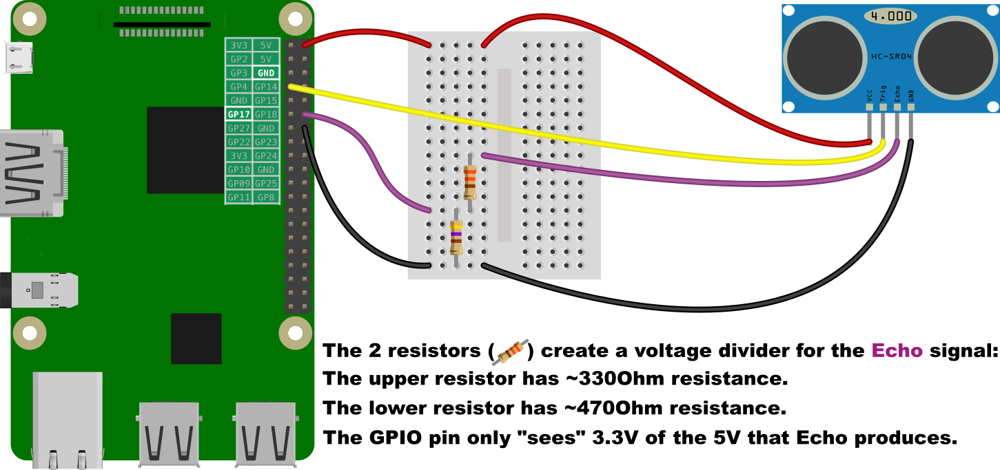
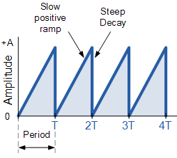
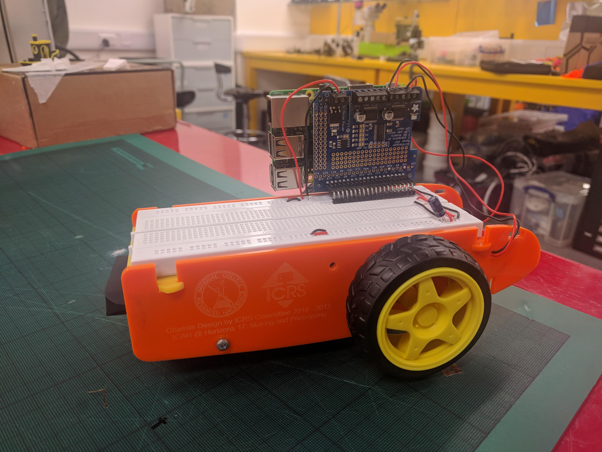
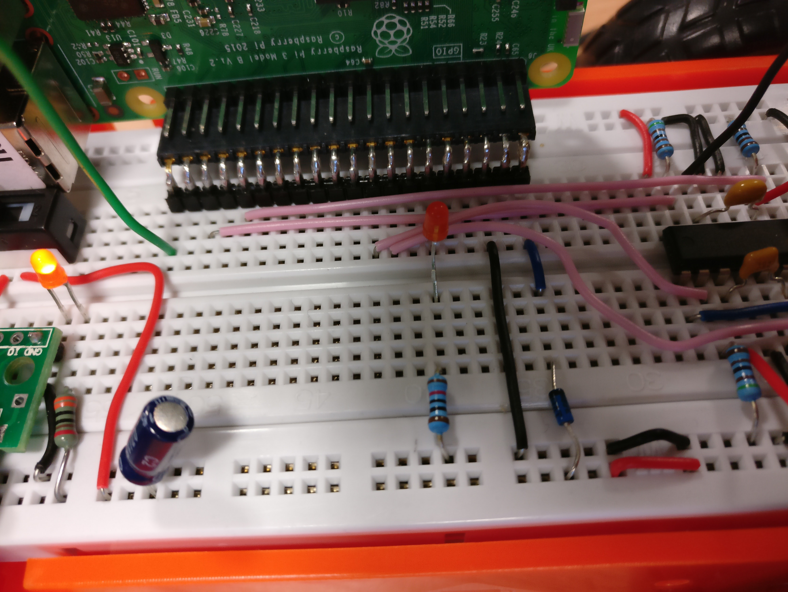
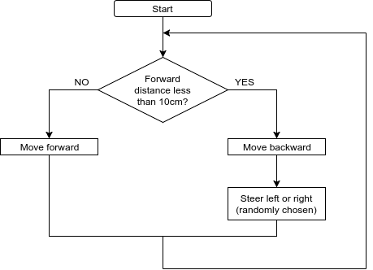
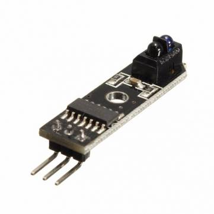

# Session 2 Workbook - Physical Computing

<p align="center">
    
</p>

# How to use this workbook & teams formation

Welcome back to the second session of the Physical Computing theme!

This week, the focus moves firmly to working in teams of 3 to 4 and doing exercises in your workbook together. All exercises happen on the actual Raspberry Pis.

Having formed teams, let's jump right in at the deep end!

# Physical Computing and the gpiozero library

Ultimately, we want you to control a physical contraption with your Raspberry Pi. For this, we'll use the General Purpose Input/Output (GPIO) pins on the side of your Pi. Their layout is shown below. Don't worry too much about it all for now, we will show you how to connect things up. Just one thing to remember: **Never connect a 5V pin directly to any other pin of the Raspberry Pi, particularly the Ground pin!**

<p align="center">
    
    <figcaption align="center">Raspberry Pi pin layout</figcaption>
</p>

## Working with libraries

You've seen the `import` statement in the last session, where we used `import numpy as np` and later `np.pi` to access the value of the mathematical constant &pi;.

The whole point is to avoid "re-inventing the wheel" by using existing software inside our programs. We do this by importing **software libraries**.

Here's an example for how powerful this idea is. Imagine you want to retrieve the raw HTML content from a website. Instead of manually coding everything up from scratch, we can do the following:

```python
import requests
r = requests.get('http://example.com') # Using everyone's favourite test domain!
print(r.content)
```

A whopping 3 lines of code to traverse the network stack, perform a HTTP GET request, await a response, save it in a variable called `r` and display it!

Things contained in libraries can be retrieved by using the dot operator `.`, such as in `requests.get`.

## Using the gpiozero library

The gpiozero library enables us to control the GPIO pins on our Pi. We start off with `import gpiozero`.

### Switching an LED

Connect an LED via a resistor to the Ground (GND) and GPIO pin 17 (GP17). Note that the shorter wire of the LED needs to connect to ground.

<p align="center">
    
    <figcaption align="center">Connecting an LED to the Pi</figcaption>
</p>

Run:

```python
import gpiozero
import time

red = gpiozero.LED(17)

while True:
    red.on()
    time.sleep(1)
    red.off()
    time.sleep(1)
```

Note how we also imported the `time` library to allow the program to sleep for one second.

### Dimming an LED

Keep the same connection, and run the below code. Note how we use the PWMLED object to control the LED. PWM stands for [**P**ulse **W**idth **M**odulation](https://www.arduino.cc/en/Tutorial/PWM), which rapidly blinks the LED and controls its brightness by switching it on and off for different amounts of times.

```python
from gpiozero import PWMLED
from time import sleep

led = PWMLED(17)

while True:
    led.value = 0  # off
    sleep(1)
    led.value = 0.5  # half brightness
    sleep(1)
    led.value = 1  # full brightness
    sleep(1)
```

Note how in this case we have used the syntax `from <library> import <thing>` to import the `PWMLED` and `sleep` functions directly. This allowed us to skip repeatedly writing `time.sleep()` etc.

### Using an ultrasonic distance sensor

We couldn't get gpiozero's own `DistanceSensor` to give us any sensible distances! So we wrote a small library that you can use instead. Download the [ICAHSensor](https://raw.githubusercontent.com/till-h/ICAHHorizons_Y2PhysComp/master/session%201/ICAHSensor.py) and save it wherever you run the below program. It provides an `ICAHSensor` object.

Wire the sensor as shown below. For this we need a breadboard, because the sensor's "Echo" returns a 5V signal, which is too much for the Pi's GPIO pins. To solve this, we have to build a small [voltage divider](https://en.wikipedia.org/wiki/Voltage_divider) to bring the signal from 5V down to 3.3V.

<p align="center">
    
    <figcaption align="center">Connecting a distance sensor to the Pi</figcaption>
</p>

Then execute the following code.

```python
from ICAHSensor import ICAHSensor
from time import sleep

sensor = ICAHSensor(trig=4, echo=18)

while True:
    print('Distance to nearest object is', sensor.get_distance(), 'm')
    sleep(0.5)
```

You can stop the program by pressing <kbd>CTRL</kbd>+<kbd>C</kbd>.

You can find many more ways of using gpiozero [here](http://gpiozero.readthedocs.io/en/stable/recipes.html).

## Exercises

Feel free to team up for these challenges. We only have a limited amount of each sensor.

1. Write a program that flashes an LED at a frequency set by the user.

1. Using gpiozero's [PWMLED object](http://gpiozero.readthedocs.io/en/stable/recipes.html#led-with-variable-brightness), write a program that repeatedly dims the LED from zero to full brightness, abruptly re-sets it to zero brightness and repeats. This is called a sawtooth wave.

    <p align="center">
        
        <figcaption align="center">A sawtooth wave</figcaption>
    </p>

1. Write a program that blinks an LED if it detects an object closer than 20cm from the distance sensor.

1. Write a program that accepts user input like "HELLOCANYOUHEARME" (all upper case and no whitespace), and translates this into an LED flashing the corresponding Morse Code.

   You will need to translate letters into dots and dashes according to the Morse alphabet. It is best to use a Python dictionary to translate between letters and Morse symbols. This can be found [here](https://raw.githubusercontent.com/raspberrypilearning/morse-code-virtual-radio/master/code/morse_lookup.py), and the timing rules for International Morse Code [here](https://github.com/raspberrypilearning/morse-code-virtual-radio/blob/master/worksheet.md#decode-the-morse-as-you-go).

1. Write a program that makes use of a line sensor (we have a few here today, so you will need to team up, depending on who is at this stage) and notifies the user whenever a black line is detected. Try to avoid repeatedly printing out whatever the line sensor sees. Instead, only notify the user when there is a change (no line &#8646; line). You will want to [wire it up correctly and familiarise yourself with the LineSensor interface](http://gpiozero.readthedocs.io/en/stable/api_input.html#line-sensor-trct5000) in gpiozero.


# May we introduce...

So we've been busy this last week to assemble you a little vehicle. May we introduce the **ICAH-101 bot**. It is very heavily based on Imperial College Robotics Society's [Robotics 101 course](http://101.icrs.io/), which you should definitely read up on here if you want to find out more about how it all works "under the bonnet".

<p align="center">
    
    <figcaption align="center">The ICAH-101 bot</figcaption>
</p>

For the rest of this theme, you will be working with this robot.

It has the following capabilities:

* **Driving around!** The two wheels on either side can be independently controlled, so you can make it go forward, backward and steer left or right, with either just one wheel spinning, or both spinning in opposite direction.

* **Blinking an LED!** (Yay...) This is a good way to check the functioning of the GPIO pins in general. We'll get to that in the first exercise.

* **Detecting a forward-facing distance.** This uses the HC-SR04 ultrasound sensor we met in the last session. Note that it detects a distance straight ahead of the robot.

* **Detecting brightness changes in the floor surface**, using 2 TCRT5000 **line sensors**. Why are they called line sensors? Because a natural application for reading brightness changes is to follow a black line on bright ground.

We won't be focussed on the electronic setup of the robot in this session, but if you want to find out more about how we actually control the motors, do have a look at the [explanation in the 101 course](http://101.icrs.io/lesson-2) ("Motor Driver").

# Exercises

1. <p align="center"><figcaption align="center">The LED connection on the robot</figcaption></p>

   Have a look at your robot and [the Raspberry Pi pin layout](http://gpiozero.readthedocs.io/en/stable/_images/pin_layout.svg) (the bottom is where the USB ports are, and it is also on your desktop background). Find out which pin the LED is connected to and get it to blink. If you're stuck, look back at the first session's workbook!

2. Driving the robot around.
 gpiozero makes it very easy to drive the robot around. (Remember the reason from last session why we use software libraries in the first place!) Look at the below sample code:
   
   ```python
   from gpiozero import Robot
   
   leftPins = (21, 16)
   rightPins = (12, 1)
   
   my_robot = Robot(left=leftPins, right=rightPins)
   
   # move around
   my_robot.forward()
   sleep(2)
   my_robot.backward()
   sleep(2)
   my_robot.left()
   sleep(1)
   my_robot.forward()
   sleep(2)
   my_robot.right()
   sleep(1)
   my_robot.backward()
   ```

   The above creates an instance of gpiozero's `Robot` object, called `my_robot`. As we create it, we tell it the correct GPIO pins for controlling the left and the right motor.

   Armed with this knowledge, `my_robot` knows exactly what signals to put out onto the pins if it is asked to move the robot forward, backward, left or right. The great thing is that we can leave the nitty-gritty of _how_ to move in either direction to the internal workings of the gpiozero library. It just presents us with handy shortcut commands called left(), right(), forward() and backward().

   To do a motion at less than full speed, you can give it a speed parameter. For example `my_robot.forward(0.5)` moves the robot forward at half of the full speed.

   You can find all the commands that you can send to the Robot object [here](http://gpiozero.readthedocs.io/en/stable/api_boards.html?highlight=robot#robot). Note that there is a handy `stop()` function that saves you from writing things like `my_robot.forward(0)`.

3. Moving out of the way when there is an obstacle in front of the robot.
 In this exercise, we stop the robot when there is an obstacle in front of it, using the ultrasonic distance sensor. Optionally, you can set it on a new course until it detects another obstacle, thus going on until its battery is depleted.

   Remember [the distance sensing code from last time](https://github.com/till-h/ICAHHorizons_Y2PhysComp/blob/master/session%201/Session%201%20Workbook%20-%20Physical%20Computing.md#using-an-ultrasonic-distance-sensor)? You will first need to wire up the sensor, including the voltage divider, as per the last session's instructions. We will once more give you a "large" and a "small" resistor to build the voltage divider.  
   We have a bigger breadboard this time to set things up on, and the front part of it is left empty for you to set up the wires for the distance sensor.

   You will be using the pins <TODO> for the Trig signal, and <TODO> for the Echo signal. A sample flowchart for the robot control is shown below - but do try out your own ideas!

   <p align="center">
      
      <figcaption align="center">A possible way to deal with obstacles.</figcaption>
   </p>

4. Stopping the robot when it crosses a black line.
 <p align="center"><figcaption align="center">The TCRT5000 line sensor module</figcaption></p>
 Instead of the ultrasonic sensor, you can use what's called a line sensor to detect an abrupt change in brightness of the ground. If we use this together with a black marker tape stuck onto a white paper, or similar, it is the perfect way to detect markings on the ground. Let's use it to stop if our robot crosses a black line! 
 In order to use the line sensor, you need to import the `LineSensor` object from gpiozero.

   ```python
   from gpiozero import LineSensor
   
   sensor = LineSensor(21) # if we connect the sensor's data pin to GPIO pin 21
   
   while True:
   	 if sensor.pin.state:
   	 	 print("No line detected.")
   	 else:
   	     print("Line detected.")
   ```

   Physically, you connect it up as follows:

   * Connect the sensor's VCC to a 3V3 pin on the Pi.
   * Connect the sensor's GND to a Ground pin on the Pi.
   * Connect the sensor's OUT to a free GPIO pin on the Pi.

   Again, feel free to change this to a more interesting behaviour, if you have time.

5. Driving the robot around in a black square.
Finally, you can use the previous exercise to drive the robot around within a box. Can you make it go as closely as possible around the inside of the perimeter? I.e., constantly keep probing to one side?